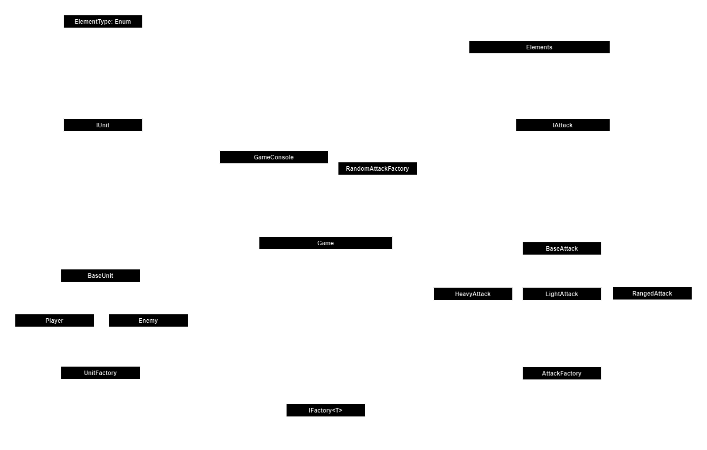

# RPG Game

Welcome to our console-based Role-Playing Game (RPG) implemented in C#. In this game, you can choose an opponent and attack them using different types of attacks. The game is designed to provide an immersive RPG experience right in your console.

## Project Structure

The project is divided into two main parts:

1. `RPG_Game`: This is the main game application. It initializes and starts the game. It's responsible for the user interface and interaction.

2. `RPG_GameLogic`: This contains the game logic, including units, attacks, factories for creating units and attacks, and the game management logic. It's the heart of the game, where all the rules and mechanics are defined.



## Features

- Multiple attack types: Choose from a variety of attack types to defeat your opponents.
- Dynamic game console: The game console provides a dynamic and interactive user interface.
- Extensible unit and attack factories: Easily add new types of units and attacks.

## Prerequisites

To run the game, you need to have .NET 8.0 installed on your machine. You can download it from the [official .NET website](https://dotnet.microsoft.com/download).

## How to Run

Once you have .NET installed, you can run the game using the following command:

```sh
dotnet run --project RPG_Game/RPG_Game.csproj
```